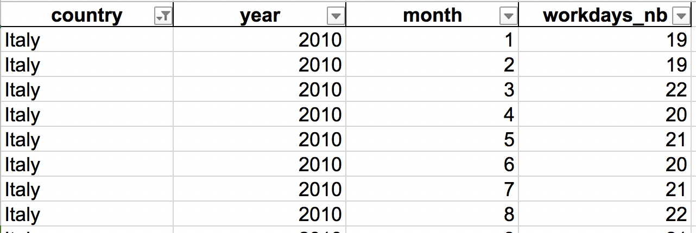

# Workdays generator

If you need to get an Excel file with the number of work days per month for a give country, this CLI may be for you. The workdays generator is based on the [`workalendar`](https://github.com/peopledoc/workalendar) package from peopledoc.

I am using it through a [virtualenv](https://virtualenv.pypa.io/en/latest/) in Python 3.7 and so should you !

## Installation

```
pip install -r requirement.txt
```

## Usage

```
Usage: generate_working_days.py [OPTIONS] FILENAME

Options:
  -y, --years TEXT  Required years (if void will generate 2010 to 2020).
  -z, --zones TEXT  Zone name in English [europe|africa|asia|america|oceania]
  --help            Show this message and exit.
```

Example

	python generate_working_days.py europe_workdays.xls -z europe
	
Generated output file where the columns are:

- `country`: country name in English
- `year`: year number
- `month`: month number
- `workdays_nb`: number of workdays

	